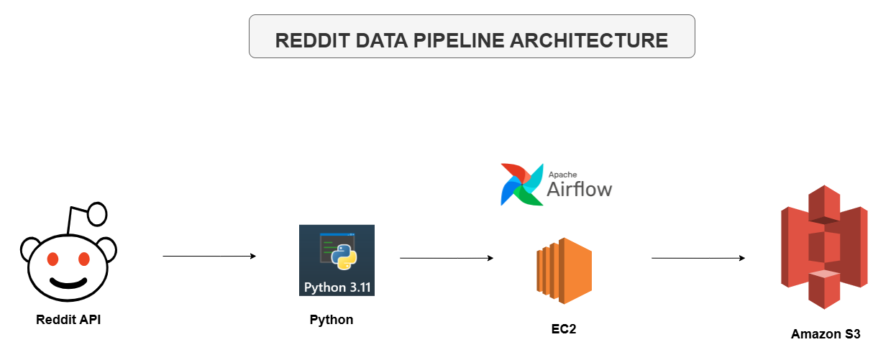

---

# Reddit Data Pipeline 🚀

This project demonstrates a scalable Reddit Data Pipeline using **Reddit API**, **Python**, **Apache Airflow**, **Amazon EC2**, and **Amazon S3**. It automates the extraction of data from the Reddit API and stores it in an S3 bucket for further analysis or processing.

---

## 📌 Architecture



**Pipeline Flow:**

1. **Reddit API** - Source of data using authenticated requests.
2. **Python Scripts** - Handle extraction, transformation, and preparation of data.
3. **Apache Airflow** - Orchestrates scheduled jobs on an EC2 instance.
4. **EC2 Instance** - Runs Airflow and executes Python scripts.
5. **Amazon S3** - Destination for storing raw or processed Reddit data.

---

## 🗂 Project Structure

```
reddit-data-pipeline/
│
├── scripts/
│   ├── reddit_dag.py         # Airflow DAG for scheduling the pipeline
│   ├── reddit_etl.py         # Main ETL logic using Reddit API
│   ├── x_etl.py              # Additional ETL or testing script
│
├── .env                      # Environment variables (e.g., Reddit API keys)
├── .gitignore                # Git ignored files
├── Architecture.drawio.png   # Architecture diagram
├── cmds.txt                 # Helpful terminal or setup commands
└── README.md                # Project documentation
```

---

## 🧪 Features

- 🔁 **Automated** and **repeatable** data collection.
- 🌐 **Reddit API integration** with OAuth2.
- ⏱️ **Scheduled pipelines** via Apache Airflow.
- ☁️ **Cloud-based storage** in Amazon S3.
- 💡 **Modular** and easily extensible ETL codebase.

---

## ⚙️ Setup & Deployment

### Prerequisites

- Python 3.11+
- AWS Account with:
  - S3 bucket
  - EC2 instance
- Reddit Developer credentials
- SSH key (`.pem`) for EC2 access
- Apache Airflow

### 1. Clone the repo

```bash
git clone https://github.com/your-username/reddit-data-pipeline.git
cd reddit-data-pipeline
```

### 2. Set up your environment

Create and activate a virtual environment:

```bash
python -m venv env
source env/bin/activate
pip install -r requirements.txt
```

Create a `.env` file and add:

```env
REDDIT_CLIENT_ID=your_client_id
REDDIT_SECRET=your_secret
REDDIT_USER_AGENT=your_app_name
```

### 3. Deploy to EC2 and start Airflow

- SSH into EC2 using `reddit_key.pem`
- Install Apache Airflow
- Move project files to EC2
- Start Airflow services and add the DAG from `scripts/reddit_dag.py`

---

## 🧼 Best Practices

- Do **not** commit `.env` or `reddit_key.pem` to version control.
- Store secrets in AWS Secrets Manager or use environment configs on EC2.
- Monitor Airflow logs for pipeline status and debugging.

---

## 📈 Future Enhancements

- Add data validation or quality checks
- Store data in Amazon Redshift or a database for analytics
- Add alerts for pipeline failure (e.g., Slack or email)

---

## Contributing

Feel free to submit issues, fork the repository, and contribute enhancements.

## 🛡️ License

This project is licensed under the [MIT License](LICENSE). You are free to use, modify, and share this project with proper attribution.


[](https://dev.to/brian_otina_)
[](https://github.com/otinabrayo)
[](mailto:brianotina20@gmail.com)
[](https://t.me/just_otina)
[](https://discord.com/channels/@otina_)

For questions or collaboration, feel free to reach out or open an issue!

---
